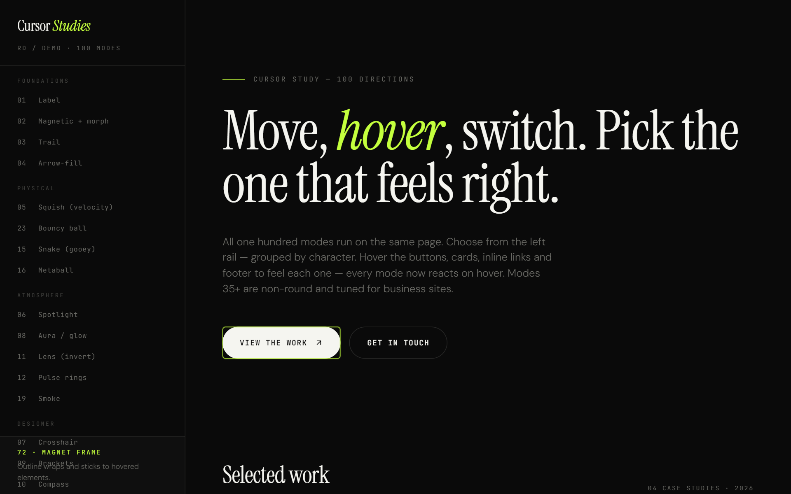

# Cursor Effects — 100 Modes

An interactive, single-file showcase of **100 custom cursor effects** for the web, built with vanilla HTML, CSS and JavaScript. No dependencies, no build step — just open `index.html`.

The collection pairs 34 original cursors with **66 new effects** designed for **professional and business websites**: clean, restrained, mostly non-round, and easy to drop into a real product. **Every new mode reacts on hover.**



## Live demo

Open `index.html` in any modern browser, or enable **GitHub Pages** (Settings → Pages → Deploy from branch → `main` / root) to get a shareable link:

```
https://vaibhavkumar-WPDEV.github.io/cursor-effects/
```

Pick a mode from the left sidebar, then hover the buttons, cards and links to feel each effect's hover state. The cursors automatically disable on touch devices.

## What's inside

| Group | Effects |
|-------|---------|
| **Foundations** | Label · Magnetic · Trail · Arrow-fill |
| **Geometric** (non-round) | Square · Diamond · Plus · Corner frame · Hexagon · Notch · Marker · Rotor |
| **Lines & Editorial** | Caret (I-beam) · Tick · Slash · Underline · Bar · Pillar · Hairline · Morph |
| **Directional** | Arrow · Chevron · Needle · Blade (rotate to face movement) |
| **Velocity** | Stretch · Skew tile · Elastic (react to speed) |
| **Line trails** | Line · Ribbon · Comet · Chain · Thread |
| **HUD / Technical** | Reticle · Scan · Ruler · Grid snap · Crosshair · Target lock · Ratio · Index |
| **Smart (element-aware)** | Magnet frame · Highlight · Link underline · Inspector · Label tag · Status |
| **Ambient** | Soft square · Spotlight · Frame glow · Tint · Pulse · Breathe · Precision · Bracket dot |
| **Bold arrows** (NEW) | Arrow bold · Arrow pro (classic) · Nav arrow · Block arrow · Double chevron · Triangle · Long arrow · Arrow box · Send · Resize · Move (4-way) · Caret up · Return · Crosshair bold · Pointer tag · Target arrow |

### Highlights for business sites
- **Magnet frame** — the outline wraps and sticks to whatever you hover (buttons, cards). Shown above.
- **Link underline** — an accent underline snaps to the exact width of any link.
- **Arrow pro (86)** — a clean, classic pointer; the safest professional default.
- **Inspector / Status** — a small tag reads `LINK / BUTTON / TEXT`.
- **Square · Caret · Underline · Precision** — restrained "default professional" picks.

## How it works

- Each mode is a `body.mode-N` class. Switching modes toggles which cursor element is active and updates the info panel.
- Every shape sits on an **inner element** while JavaScript moves the **wrapper**, so CSS transforms (rotate/scale/skew) never fight the positioning transform.
- Only the **active** mode's animation runs each frame (`requestAnimationFrame`).
- Hover is handled globally: a `cursor-hover` class is toggled on `<body>`, and every mode has a matching `body.mode-N.cursor-hover` reaction (size, colour, fill, or — for the smart modes — wrapping the hovered element).
- Four trail effects share a single `<canvas>` overlay; switching modes clears it.
- Touch devices are detected via `pointer: fine` and fall back to the native cursor.

> Tested headlessly across all 100 modes: no console errors, every mode switches, follows the pointer pixel-accurately, and reacts on hover.

## Customizing

The palette lives in CSS variables at the top of `index.html`:

```css
:root {
  --bg: #0a0a0a;
  --text: #f5f5f0;
  --accent: #c4ff3d;   /* change the accent color here */
  --cursor: #ffffff;   /* base cursor color */
}
```

To reuse an effect on your own site, copy that mode's CSS block, its cursor element markup, and its handler in the `newFrames` map (or the matching block in `tick()` for modes 1–34).

## License

[MIT](LICENSE) © 2026 Vaibhav Kumar
